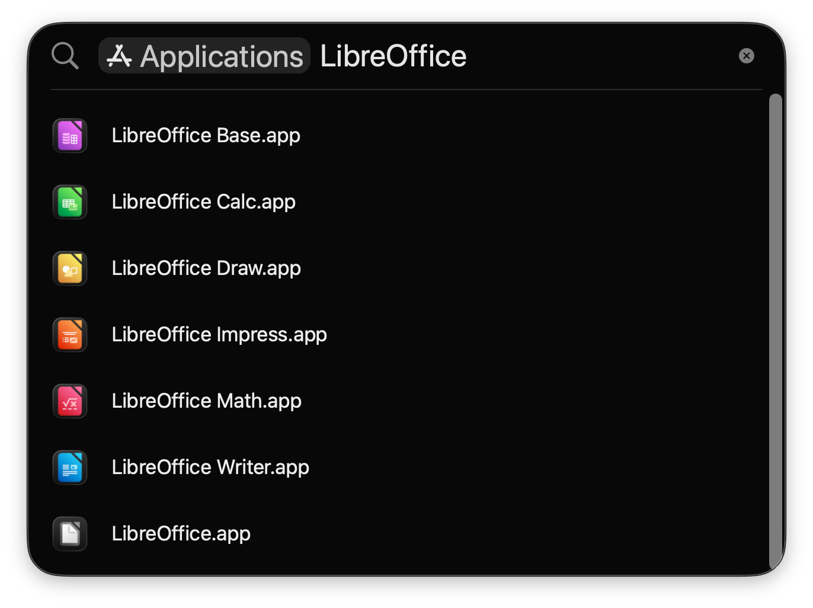
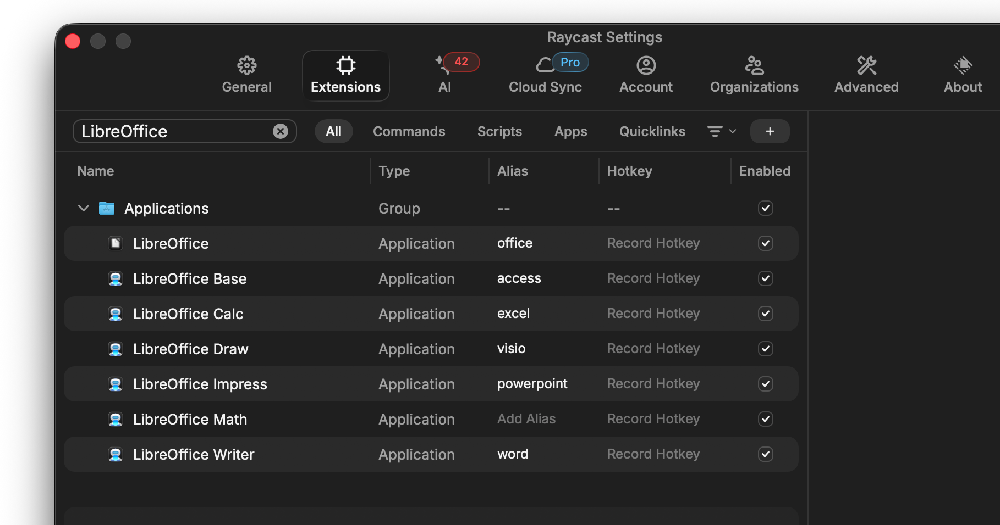

# LibreOffice Launchers for macOS

Separate, Spotlight-friendly (or Alfred, or Raycast, or etc...) .app launchers for each module in the incredible **[LibreOffice](https://www.libreoffice.org/)** suite on macOS.

These tiny shell-script driven apps allow you to launch **Writer**, **Calc**, **Impress**, **Draw**, **Base**, and **Math** directly — no need to open the main LibreOffice hub first. Handy for keyboard warriors.

> [!NOTE]
> These .app launchers were built using the excellent [Platypus for macOS](https://sveinbjorn.org/platypus) by Sveinbjörn Þórðarson.

**Tip**: You can also setup aliases in your launcher of choice in case you have Microsoft Office muscle-memory:

---

## Features

- One launcher per LibreOffice module (Base, Calc, Draw, Impress, Math, Writer).
- Icons for easy recognition.

---

## Installation

Go to the [Releases](https://github.com/jtbrough/LibreOffice-Launchers/releases) page to download the latest `.zip` containing all the apps.

1. Download the `Release.zip`.
2. Unzip it.
3. Drag the `.app` files to your `~/Applications` folder (or wherever you prefer).
4. Launch away.